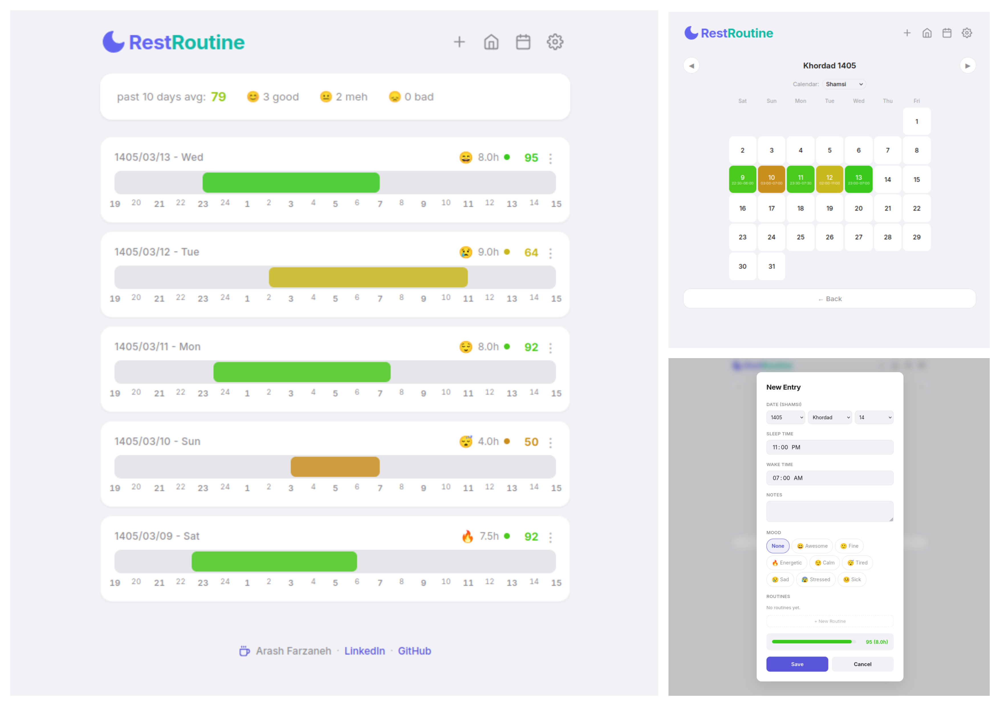

# 🌙 RestRoutine

Sleep matters! both its duration and its timing.

RestRoutine is a clean, privacy-focused, client-side sleep tracker and routine optimizer. It features multi-calendar support (Gregorian, Shamsi, and Hijri), habit logging, mood mapping, and a custom sleep-scoring calculator.

[](https://arashfarzaneh.github.io/RestRoutine/)
[](https://opensource.org/licenses/MIT)

---

## 🎨 Visual Preview



---

## 🚀 Live Demonstration

Try the application directly in your browser with zero setup required:
👉 **[Launch RestRoutine Live Demo](https://arashfarzaneh.github.io/RestRoutine/)**

---

## ✨ Key Features

* **Data-Driven Sleep Scoring:** Rates your sleep using an algorithm that factors in both total duration ($70\%$) and the consistency of your sleep window timings ($30\%$).
* **Multi-Calendar Support:** Seamlessly switch views and record data natively using **Gregorian**, **Shamsi (Jalaali)**, or **Tabular Hijri** calendar systems.
* **Routine & Habit Tracker:** Log daily routines (Completed `✓`, Partial `~`, Failed `✕`) to visually correlate how your daytime habits impact your rest.
* **Visual Time-blocking:** Displays an hourly timeline tracking card for every entry to give you an immediate visual overview of your sleep patterns.
* **Local Privacy:** 100% client-side. Your data never leaves your browser; it is stored securely via `localStorage` and includes simple `.json` export/import tools for backups.

---

## 🏗️ Architecture & Codebase Structure

The project is built using decoupled vanilla JavaScript modules organized under a single global namespace (`window.SleepApp`).

```text
.
├── css
│   └── style.css          # Modern, clean variable-based stylesheet
├── index.html             # Semantic HTML5 layout structure 
├── js
│   ├── app.js             # Application initialization, event listeners, and main views
│   ├── calendar.js        # Monthly grid renderer and navigation logic
│   ├── modal.js           # Form inputs, field validation, and entry details
│   ├── scoring.js         # Scoring math and duration calculation utilities
│   ├── storage.js         # Interface for HTML5 LocalStorage and data backups
│   └── timeline.js        # Renders the visual hourly timeline blocks
└── lib
    └── jalaali.js         # Calendar conversion algorithm utility
