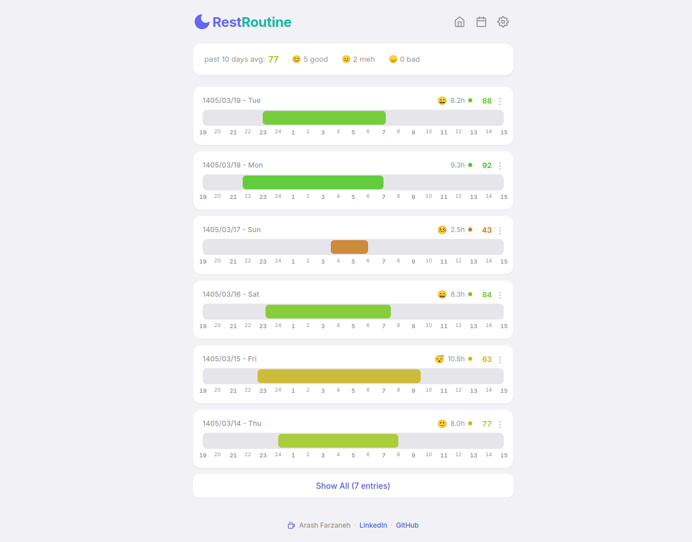

# 🌙 RestRoutine

An elegant, privacy-first, client-side sleep tracker and routine optimizer. It features multi-calendar support (Gregorian, Shamsi, and Hijri), custom routine logging, morning mood mapping, and an intelligent dynamic sleep-scoring engine.

[](https://arashfarzaneh.github.io/RestRoutine/)
[](https://opensource.org/licenses/MIT)

---

| Main Dashboard View | Multi-Calendar Grid |
| :---: | :---: |
|  |

---

## 🚀 Live Demonstration

Experience the app instantly inside your browser with zero configurations required:
👉 **[Launch RestRoutine Live Demo](https://arashfarzaneh.github.io/RestRoutine/)**

---

## ✨ Key Features

* **Intelligent Sleep Scoring:** Evaluates your night using a dynamic algorithm combining absolute sleep duration ($70\%$) and precise sleep window timings ($30\%$).
* **Multi-Calendar Ecosystem:** Seamlessly toggle views and record timestamps natively across **Gregorian**, **Shamsi (Jalaali)**, and **Tabular Hijri** calendar systems.
* **Routine Correlation Tracker:** Log granular custom daily habits (Completed `✓`, Partial `~`, Failed `✕`) to visually map how routines influence rest.
* **Visual Time-blocking:** Renders a responsive linear hourly timeline tracking card for an immediate macro-overview of your biological rhythm.
* **Complete Data Sovereignty:** 100% serverless. Your data stays in your browser via `localStorage` with native `.json` backup export and restore mechanisms.

---

## 🎨 Visual Preview

> 💡 *Tip: Take 2 or 3 screenshots of your application (the main timeline dashboard, the multi-calendar layout, and the modal view) and place them in an assets folder to display here!*

| Main Dashboard View | Multi-Calendar Grid |
| :---: | :---: |
|  |  |

---

## 🏗️ Architecture & Codebase Structure

The project relies on decoupled vanilla modules encapsulated cleanly inside a unified global namespace (`window.SleepApp`).

```text
.
├── css
│   └── style.css          # Modern iOS-inspired custom variable theme sheet
├── index.html             # Semantic layout component structure 
├── js
│   ├── app.js             # Core bootstrap event bindings and view controllers
│   ├── calendar.js        # Matrix grid UI renderer for monthly views
│   ├── modal.js           # Input form, field validators, and preview states
│   ├── scoring.js         # Math mathematical algorithm metrics for sleep quality
│   ├── storage.js         # Abstracted HTML5 LocalStorage interface pipeline
│   └── timeline.js        # Core engine generating linear structural tracks
└── lib
    └── jalaali.js         # Low-level algorithm layer converting Jalaali calendars
